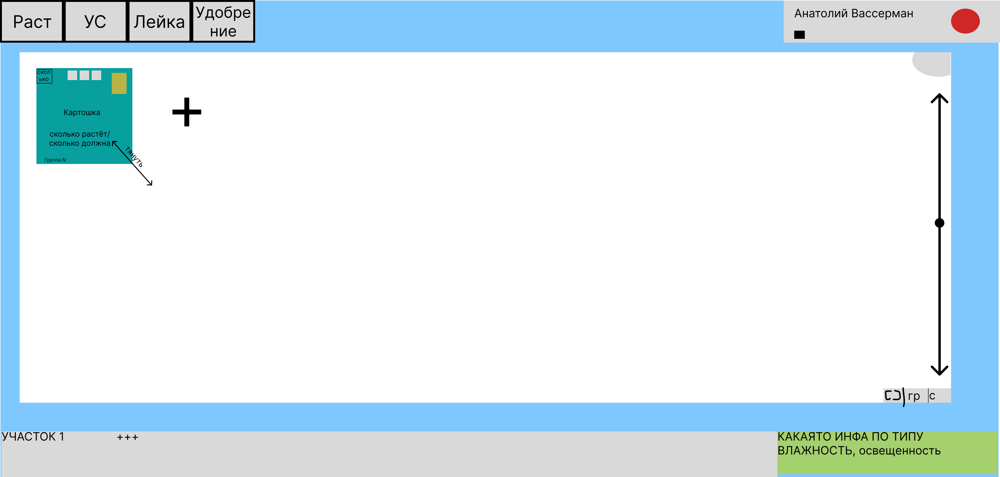
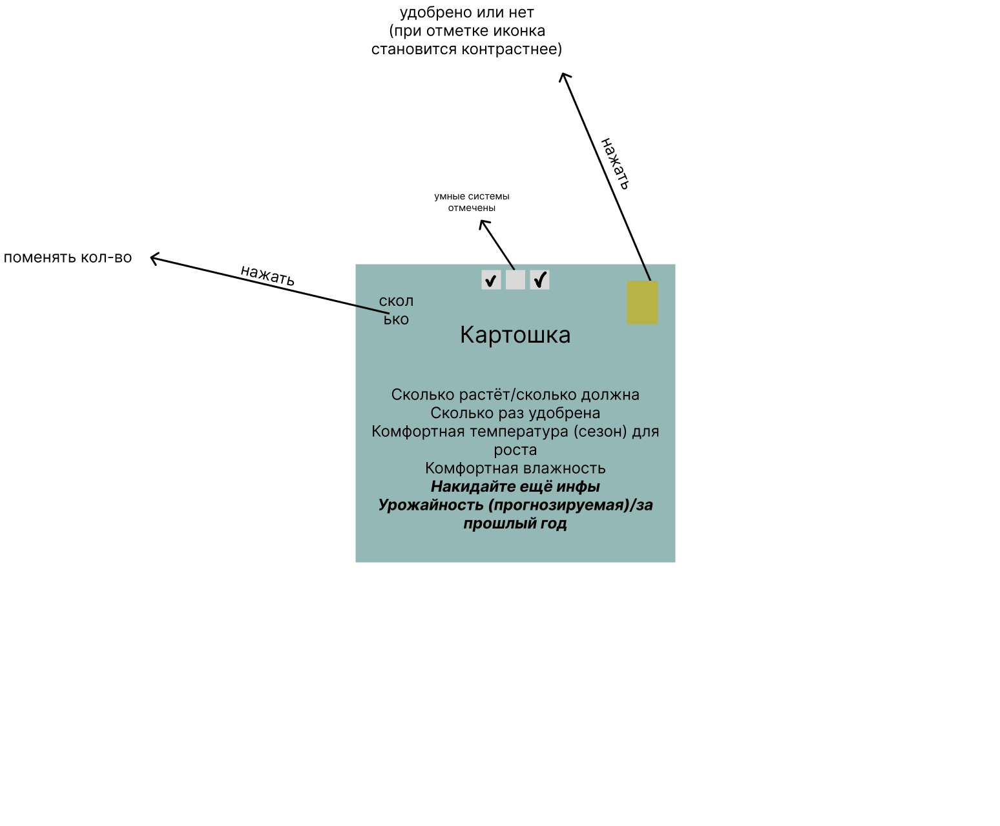
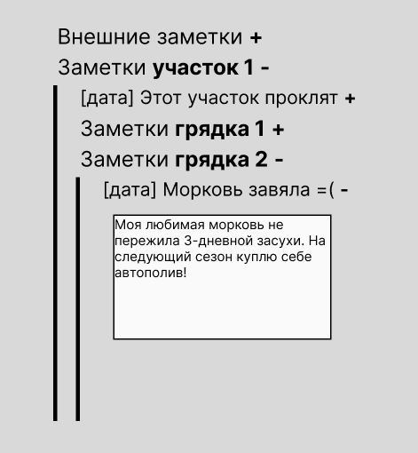
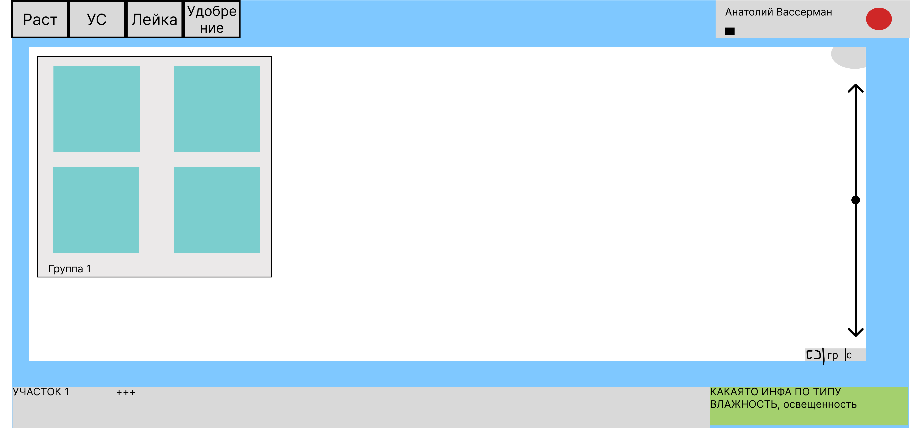

# Оглавление

1. [Электронный двойник участка](#электронный-двойник-участка)
    1. [Флоу использования приложения](#флоу-использования-приложения)
        1. [Грядка](#грядка)
        2. [Дневник](#дневник)
        3. [Взаимодействие с грядками](#взаимодействие-с-грядками)
        4. [Группы](#группы)
    2. [Не утверждено](#не-утверждённоене-проработанолень-прописывать)
2. [Как редачить этот файл](#как-редачить-этот-файл)
3. [Как работать с гитом](#как-работаем-с-гитом)
    1. [Коммиты](#коммиты)
    2. [Ветки](#ветки)

# Электронный двойник участка

Приложение позволяет отслеживать рост растений на участках, фиксировать уход за растениями, а также проектировать будущие посевы, собирать статистику (урожайность...). Также предполагается возможность подключения умных систем (автополив, автоосвещение) и удалённый доступ к ним.

## Флоу использования приложения

Пользователь создаёт новый участок. На участке он создаёт грядки и может в них сажать растения. В каждой грядке может быть разное количество лунок, пользователь сам задаёт количество. Грядки можно поливать, когда они засажены, и удобрять, когда они пустые. Их состояние (полито/удобрено) отображается цветом и символами. На грядке может быть высажено только один вид растений. Также к грядкам можно подключать умные системы. 

<i>макет приблизительный и создан только для демонстрации возможностей и примерного видения</i>

### Грядка

Пользователь нажимает на грядку и смотрит информацию по высаженному растению (сколько дней растёт засаженное растение, сколько раз поливалось и т.д.) и изменяет количество посаженных растений. Также пользователь может объединять грядки в группы, чтобы можно было поливать или удобрять разом.
   К грядкам можно подключать умные системы, которые автоматически поливают грядки, настраивают освещение или температуру.

### Дневник

Пользователь может вести записи в дневнике. Дневник имеют древовидную систему, в которой 3 уровня:

1. Внешний
2. Уровень участка
3. Уровень грядки

### Взаимодействие с грядками

Грядки можно:
* засаживать
* поливать
* удобрять
* подключать удалённые системы
* группировать
* менять местами и масштабировать
* менять параметры

Первые 4 взаимодействия происходят при помощи верхнего тулбара

 

При нажатии на <b>Лейка</b> или <b>Удобрение</b> курсор пользователя меняет свой вид и при нажатии на грядку:
1. Грядка меняет свой цвет на голубой (в случае лейки);
2. Появляется значок удобрения (в случае удобрения).

При нажатии на остальные меню всплывает окно со списком растений или умных систем. Также при нажатии на конкретный объект мышка меняет свой вид и участок становится либо засаженным каким-то растением, либо к нему подключается умная система.

### Группы

Грядки можно объединять в группы. При создании новой грядки всплывает небольшое меню с выбором группы или создания новой (достаточно ввести просто название). После того, как выбрана группа, грядка будет ассоциироваться с другими грядками в этой группе.

Изначально это никак не влияет на функционал, однако у участка есть 2 вида отображения: сетка или группами. Отображение группами позволяет видеть на участке группы грядок и одновременно все грядки в группе поливать/удобрять/применять УС одной кнопкой.

## Не утверждённое/не проработано/лень прописывать

* поделиться участком
* окно состояний (зелёный прямоугольник)
* окно аккаунта
* масштабирование (стрелка в правой части сайта)

# Как редачить этот файл

Пожалуйста, придерживайтесь структуры, которую я выстроил. Все проработанные объекты вносить под заголовок второго уровня [<b>Флоу использования приложения</b>](#флоу-использования-приложения) с заголовком третьего уровня (например "### Аккаунт").

Также не редактируйте этот файл с гитхаба, редачьте с IDE, которое стоит на вашем компе, и потом заливайте в ветку <b>main</b>.

# Как работаем с гитом

### Коммиты

Статьи с описанием конвенции коммитов в гите:
* <https://www.conventionalcommits.org/ru/v1.0.0-beta.4/>
* <https://gist.github.com/DmitriiNazimov/f9cf7d0631d12c19827518b8bd8134c4>
* <https://habr.com/ru/companies/yandex/articles/431432/>

За основу берём именно пост от яндеха (3 ссылка), там подробно описано. Утилиты пока не ставим, просто читаем про суть вещей.

### Ветки

Можно почитать на досуге [Git-flow](https://nvie.com/posts/a-successful-git-branching-model/).

У нас есть 2 основные ветки:
* main
* develop

Ветку <b>main</b> мы не трогаем, вообще забываем про её существование, работаю с ней только <b>ЯЯЯЯЯЯЯ</b>(или кто-нибудь с ролью dev-ops'а, если мы решим такую роль выделить).

Теперь обсудим ветку <b>develop</b>. Напрямую в ней мы тоже стараемся не работать. Если мы садимся реализовывать какой-то функционал, то создаём под это отдельную ветку из <b>develop</b> и называем <b>feature-{имя функционала}</b>. 

Например, Юля села реализовывать страницу участка. Для начала она создаёт ветку <b>feature-plot-page</b>. После этого она спокойно работает в своей ветке, коммитит туда по своему желанию, пушит, а после сливает в <b>develop</b>, проходя при этом код-ревью. 

